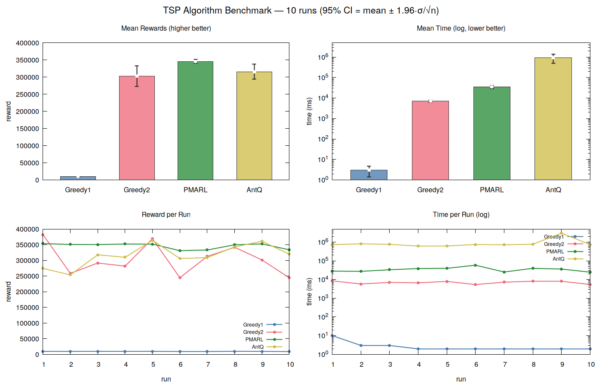
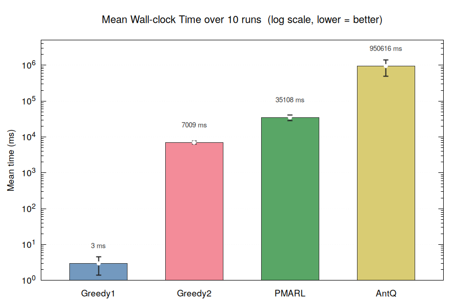
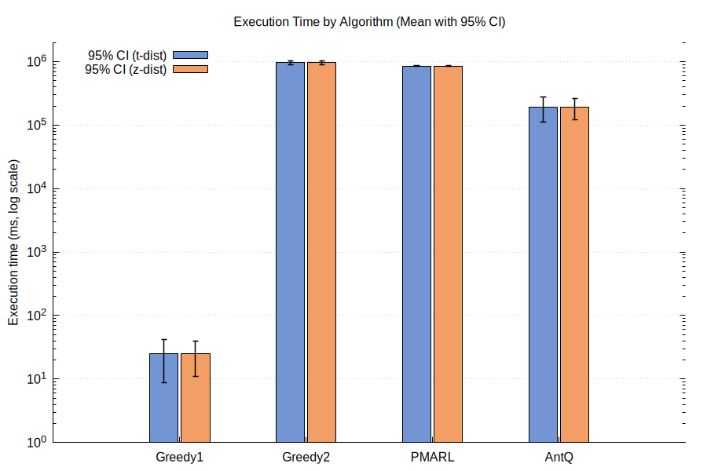
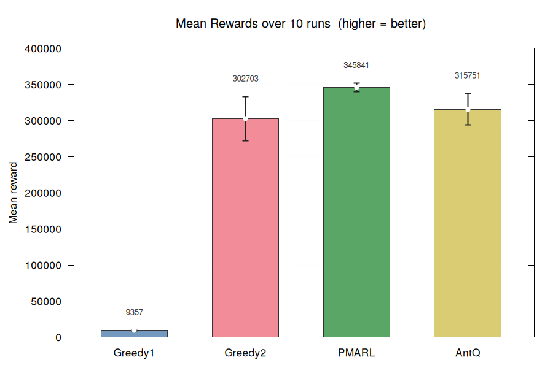
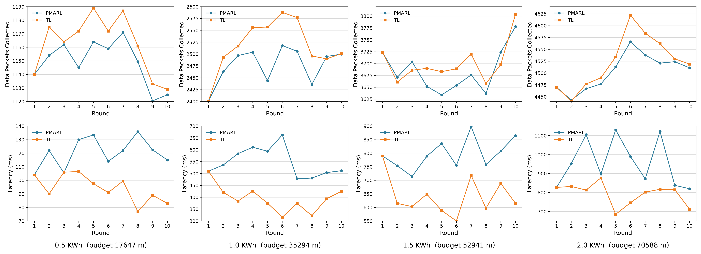

# TransferLearning — P-MARL for BC-TSP

This is the actively-maintained Maven implementation of the paper **"Budget-Constrained
Traveling Salesman Problem: a Cooperative Multi-Agent Reinforcement Learning Approach"**
(P-MARL). It has two independent entry points:

| Class | What it runs | Scale |
|---|---|---|
| `Main` (`src/main/java/pmarl/Main.java`) | Static BC-TSP benchmark: Greedy1, Greedy2, P-MARL, and Ant-Q compete on a single large city graph | 13,509 US cities, one 10,000,000-mile budget |
| `RSNDynamicSimulation` (`src/main/java/pmarl/RSNDynamicSimulation.java`) | "rsnd" — dynamic Robotic Sensor Network simulation from **paper Section V-C**. Compares cold-start P-MARL against Transfer Learning (Algorithm 4) as sensor data changes round-to-round | 100 sensor nodes, 4 battery budgets, 10 rounds |

The rest of `src/main/java/pmarl/` (`TableData.java`, `Exploration.java`, `Graph.java`,
`Agent.java`, `CityNode.java`, plus the old `AntQ.java` class and the 48-city gnuplot
pipeline) is earlier, unmaintained code kept for reference — see
[`src/main/java/pmarl/README.md`](src/main/java/pmarl/README.md) for that layer. Everything
below describes the current code (`Main` + `RSNDynamicSimulation`), which is self-contained,
reads `src/city_rewards.csv` / `src/main/resources/city_rewards.csv` directly, and does not
depend on any of the legacy classes.

---

## Requirements

- Java 17 (`maven.compiler.release` in `pom.xml`)
- Maven

```bash
cd TransferLearning
mvn -q compile   # sanity check the build
```

> **Fixed in this pass:** the file used to be `main.java` containing `public class Main`,
> which only compiles on a case-insensitive filesystem (Windows). It has been renamed to
> `Main.java` to match the class name, which is required by the Java spec and needed for the
> project to build on Linux/macOS or in CI.

---

## How to execute `Main` (13,509-node benchmark)

```bash
mvn compile exec:java -Dmain.class=Main
```

`-Dmain.class=Main` is required even though it's the default — the POM's `exec-maven-plugin`
mainClass is bound to the `main.class` **property** (`<mainClass>${main.class}</mainClass>`),
not to the plugin's own `exec.mainClass` property, so plain `-Dexec.mainClass=...` is silently
ignored. `mvn compile exec:java` alone also works since `main.class` already defaults to
`Main` in `pom.xml`.

### What it does

1. Loads the first `MAX_NODES = 13,509` rows of `city_rewards.csv` (classpath resource under
   `src/main/resources/`) as a complete Euclidean graph. Node 0 is the depot; a duplicate depot
   node is appended at the end (`NN - 1`) so the salesman's path is a round trip. Each of the
   13,508 non-depot cities has an integer prize in `[1, 100]`.
2. For `RUNS = 10` independent trials, it picks a new random start/end depot city, then runs
   all four algorithms back-to-back on the **same** budget (`BUDGET = 10,000,000` miles):
   - **Greedy1** — visit budget-feasible cities in descending prize order (paper Algo. 1).
   - **Greedy2** — visit budget-feasible cities by best prize/distance ratio (paper Algo. 2).
   - **P-MARL** — Algorithm 3 (independent + cooperative learning), `M = 5` agents.
   - **AntQ** — prize-oblivious pheromone baseline (paper's Ant-Q comparison), `5` ants.
3. Prints a per-run table, then a 10-run summary with 95% confidence intervals
   (`mean ± 1.96·σ/√n`) for prize collected, distance traveled, and wall-clock time.

### Sample output (single verified run, node count and header are exact; algorithm
values will differ run-to-run because start/end cities and PAM exploration are randomized)

```
=== BC-PC-TSP  source=city_rewards.csv  nodes=13508  budget=10000000  runs=10  W=5114 ===

  Algorithm     Rewards          Dist     Remaining   Time(ms)
  ─────────────────────────────────────────────────────────────

  ── Run  1/10  (start city=1295) ──
  Greedy1          9457    9999397.99        602.01         76
  Greedy2        382072    9999999.68          0.32      10150
  PMARL          353475    9999943.04         56.96      41704
  AntQ            ...
```

`W` (the PRM reward-model constant, see formulas below) is computed automatically from the
data: `W = (sum of all prizes / number of cities) × 100`, so it scales with whatever
`city_rewards.csv` is loaded — printed as `5114` for the full 13,509-city file.

### Memory

`D`, `Q_tab`, `R_tab` are each `NN × NN` `double[][]` — at `NN ≈ 13,510` that's
**~1.46 GB per matrix**. Ant-Q adds two more `NN × NN` matrices (`aqTau`, `aqTauLastEp`), so a
full run needs on the order of **6–8 GB of heap**, confirmed by reproducing an
`OutOfMemoryError: Java heap space` locally at the default heap.

The `pom.xml` sets `<jvmArgs><jvmArg>-Xmx6g</jvmArg></jvmArgs>` on the exec plugin, but
`mvn exec:java` runs **in Maven's own JVM by default and does not honor `jvmArgs`** for heap
sizing (only the `exec:exec` goal, which launches a real subprocess, would). Set the heap via
`MAVEN_OPTS` instead:

```bash
# bash / Git Bash
MAVEN_OPTS="-Xmx10g" mvn compile exec:java -Dmain.class=Main

# PowerShell
$env:MAVEN_OPTS = "-Xmx10g"; mvn compile exec:java -Dmain.class=Main
```

To iterate faster on a smaller graph, lower `MAX_NODES` in `Main.java` (see the memory guide
in the file's header comment: 500 nodes ≈ 6 MB, 1,000 ≈ 24 MB, 5,000 ≈ 600 MB).

`Main` prints to stdout only — it does not write to `results/` itself. Redirect manually to
keep a record, matching the naming already used in `results/`:

```bash
MAVEN_OPTS="-Xmx10g" mvn -q compile exec:java -Dmain.class=Main > results/results_budget10M_$(date +%Y%m%d_%H%M%S).txt
```

---

## How to execute `RSNDynamicSimulation` ("rsnd") — what it represents

```bash
mvn compile exec:java -Dmain.class=RSNDynamicSimulation
```

This reproduces **paper Section V-C / Algorithm 4** (the local-search-based transfer-learning
mechanism for dynamic RSN scenarios), not the static 13,509-city benchmark above. It models a
single robot doing repeated round-trip data-collection tours from a fixed set of wireless
sensor nodes whose data changes over time, and asks: *is it better to retrain P-MARL from
scratch every round, or warm-start the Q-table from the previous round and locally repair it?*

**Setup, generated each independent trial:**
- 100 sensor nodes scattered uniformly in a 10,000 m × 10,000 m field; the depot sits at
  `(0,0)` and is duplicated as both the start and end node, so the round trip has zero
  baseline travel cost (matches the RSN setting in paper Fig. 13(b)).
- Each sensor starts with `1–100` data packets; **10 of the 100 nodes have their packet count
  re-randomized every round**, simulating a live sensor field.
- 4 robot battery budgets: `0.5 / 1.0 / 1.5 / 2.0 KWh`, converted to a travel budget in meters
  via `budget = KWh × 3,600,000 / (600 kg × 0.17 friction coeff.)` — i.e. `budget = KWh × 3,600,000 / 102`.
  This reproduces the exact figures in the committed results
  (`0.5 KWh → 17,647 m`, `1.0 KWh → 35,294 m`, `1.5 KWh → 52,941 m`, `2.0 KWh → 70,588 m`).
- **10 rounds** per trial, **10 independent trials** averaged per battery level.

**Each round, two competitors run on the same changed data:**
- **P-MARL** — Q/R tables reset from scratch, then Algorithm 3 (independent + cooperative
  learning) runs to convergence. This is the "no memory" baseline.
- **TL (Transfer Learning)** — carries the Q-table forward from the previous round. Path edges
  are capped at `K_WARM × qInit` (5×) so they keep a head start without permanently dominating
  exploration; off-path edges are reset to the current round's `qInit`. Algorithm 4's local
  search then walks the previous best path and, for any node whose prize *decreased*, looks
  for a better-prized replacement within a `1,500 m` neighborhood that still fits the leftover
  budget, redirecting Q toward it before P-MARL runs again.

The comparison is exactly what's plotted in the `rsn_prize_revised` figure: **data packets
collected** (top row) and **wall-clock latency** (bottom row) per round, for each battery
budget, PMARL vs TL.

### Sample output (fully reproducible — the RNG is seeded with `42`, so
these numbers match `results/rsn_dynamic_prizes_20260618_011834.txt` exactly)

```
=== RSN Dynamic Prize Simulation (Section V-C) ===
Nodes=100  Field=10000x10000 m  Rounds=10  Changes/round=10  Runs=10
α=0.1  γ=0.6  q0=0.5  δ=1  β=2  W=10000  EPI_MAX=1000  STAG=100  M=30

══════  Battery=0.5 KWh  Budget=17647 m  ══════
  ...
  Round      PMARL pkts        TL pkts         PMARL ms            TL ms
  ─────────────────────────────────────────────────────────────────────
  1              1140.1         1140.1            103.7            103.7
  2              1154.0         1174.6            122.2             90.1
  ...
```

Output is written automatically (unlike `Main`) to `results/rsn_dynamic_prizes_<timestamp>.txt`
(console log) and `.csv` (`battery_kwh,round,pmarl_packets,tl_packets,pmarl_ms,tl_ms`) — no
redirection needed. This run is much cheaper than `Main`'s (100 nodes vs 13,509), it completes
in well under a minute with the default heap.

---

## Algorithms and formulas (from the paper)

**Budget-feasible nodes** — the core feasibility check used everywhere below. From node `c`
with remaining budget `B`, a node `u` is budget-feasible iff the agent can still reach the
depot `d` after visiting it:

```
F(c, B) = { u : w(c,u) + w(u,d) ≤ B,  u unvisited }
```

**PC-table Bellman update** (Eq. 8 — single-agent form; used conceptually, the multi-agent
version below is what's actually coded):

```
P(c,a) ← (1-α)·P(c,a) + α·[ r(c,a) + γ·max_b P(a,b) ]
```

**Prize-based Action Mechanism (PAM)** — how every agent (P-MARL and the RSN simulation) picks
its next city. With probability `q0`, exploit; otherwise explore.

- Exploitation (Eq. 9):
  ```
  next = argmax_{u ∈ F(c,B)}  [P(c,u)]^δ · p_u / [w(c,u)]^β
  ```
- Exploration (Eq. 10) — same score, sampled proportionally:
  ```
  p(c,a) = ([P(c,a)]^δ · p_a / [w(c,a)]^β) / Σ_{u ∈ F(c,B)} ([P(c,u)]^δ · p_u / [w(c,u)]^β)
  ```
  `δ` weights how much the learned Q-value matters; `β` weights how much distance is
  penalized. Both are `1` and `2` respectively in every experiment here.

**Independent Learning phase update** (Eq. 11 — what `Main.runMARL()` and
`RSNDynamicSimulation.runMARL()` actually apply per agent step; note it omits the reward term
because, mid-episode, no agent yet knows if its edge is on the winning path):

```
P(c,a) ← (1-α)·P(c,a) + α·γ·max_{b ∈ F(a,B)} P(a,b)
```

**Cooperative Learning phase — Prize-based Reward Model (PRM)**. After all agents finish an
episode, the agent with the highest prize (`j*`) is found, and every edge on its path is
reinforced:

```
r(u,v) ← r(u,v) + W / P_max                                    (Eq. 12)
P(u,v) ← (1-α)·P(u,v) + α·[ r(u,v) + γ·max_b P(v,b) ]           (Eq. 13)
```

`W` is a tuning constant — `Main.java` derives it from the data (`W = mean(prize) × 100`) so
it stays proportional to prize magnitude regardless of the dataset; `RSNDynamicSimulation`
uses a fixed `W = 10,000` since the paper's Section VI-B hyperparameters are used verbatim.

### Hyperparameter reference

| Symbol | Meaning | `Main` (13,509-city) | `RSNDynamicSimulation` |
|---|---|---|---|
| `α` | learning rate | 0.125 | 0.1 |
| `γ` | discount factor | 0.35 | 0.6 |
| `δ` | PAM exponent on Q-value | 1.0 | 1.0 |
| `β` | PAM exponent on distance | 2.0 | 2.0 |
| `q0` | exploit-vs-explore threshold | 0.8 (annealed, see below) | 0.5 |
| `W` | PRM reward constant | derived: `mean(prize) × 100` | 10,000 |
| `m` / `M` | number of learning agents | 5 | 30 |
| episodes | training episodes per call | 15,000 (`TRIALS`) | 1,000 (`EPI_MAX`) |
| stagnation limit | early-stop after N episodes with no improvement | 500 | 100 |
| candidate list | top-K cities scanned per PAM step (perf. optimization, not in paper) | 50 | n/a (only 100 nodes) |

`Main.java` anneals the exploitation threshold across training instead of using a flat `q0`:
`eps = 1 - q0·(TRIALS - ep)/TRIALS`, so early episodes explore more and later episodes exploit
the learned PC-table more — this is an implementation refinement on top of the paper's PAM,
not a formula in the paper itself.

### Ant-Q baseline (in `Main.java`)

Implements the same three differences from P-MARL that
[`src/main/java/pmarl/README.md`](src/main/java/pmarl/README.md#note-on-ant-q) describes for
the old code: no prize term in the action rule (pure pheromone `τ^φ · (1/dist)^η`), pheromone
deposit based on the shortest-distance ant rather than the highest-prize agent, and no separate
reward table. Node prizes are only used to score the final route, never during learning — this
is what "prize-oblivious" means in the paper's Fig. 4/8 comparisons.

---

## Results

The images below are referenced by path but are **not committed to this repo** — save them
into `results/figures/` using the filenames listed so the links resolve:

| File to save | Chart | Source |
|---|---|---|
| `results/figures/dashboard.png` | 4-panel benchmark dashboard (mean reward, mean time log-scale, reward per run, time per run) | 13,509-node `Main` run |
| `results/figures/reward_per_run.png` | Reward per run, consistency across 10 random start cities | 13,509-node `Main` run |
| `results/figures/time.png` | Mean wall-clock time per algorithm, log scale | 13,509-node `Main` run |
| `results/figures/exec_time.png` | Execution time per algorithm with 95% CI (t-dist vs z-dist) | separate 115,475-node run (not reproducible from this repo) |
| `results/figures/rewards.png` | Total rewards per algorithm with 95% CI (t-dist vs z-dist) | separate 115,475-node run (not reproducible from this repo) |
| `results/figures/rsn_prize_revised.png` | 8-panel PMARL-vs-TL data packets + latency, 4 battery levels × 10 rounds | `RSNDynamicSimulation` ("rsnd") |

### 13,509-node benchmark (`Main`, `city_rewards.csv`, budget 10,000,000 mi)





Mean wall-clock time over 10 runs (log scale, lower is better):

| Algorithm | Mean time (ms) |
|---|---|
| Greedy1 | 3 |
| Greedy2 | 7,009 |
| P-MARL | 35,108 |
| Ant-Q | 950,616 |

P-MARL collects the most prize on average (~349,000, tightest CI of the three learning/greedy
contenders) while running two orders of magnitude faster than Ant-Q — consistent with the
paper's Fig. 4 finding that P-MARL dominates Greedy1/Greedy2/Ant-Q on prize collected, and with
Section VI-A2's finding that P-MARL trains far faster than heavier baselines. Greedy1 collects
almost no prize by comparison (~9,000) because always chasing the single highest-prize city
burns budget on long detours (same failure mode the paper describes in Section VI-A1).

### 115,475-node run (separate, larger dataset — not in this repo)




These two charts come from a run against a ~115,475-city dataset (an order of magnitude larger
than `usa13509`/`city_rewards.csv`). That dataset and the script that produced these numbers
are not committed here — only the `city_rewards.csv` (13,509-node) input exists in this repo,
so this pair of charts cannot currently be reproduced with `mvn compile exec:java`. They're
included for reference; total-reward magnitudes scale roughly with node count versus the
13,509-node run (~2.87M vs ~349K, roughly the expected ~8.5× ratio), which is consistent with
both runs using the same algorithm and hyperparameters at different scale.

### RSN dynamic simulation ("rsnd", `RSNDynamicSimulation`, Section V-C)



This is fully reproducible (`mvn compile exec:java -Dmain.class=RSNDynamicSimulation`, fixed
seed `42`) and matches `results/rsn_dynamic_prizes_20260618_011834.{txt,csv}` exactly. Across
all four battery budgets, TL matches PMARL in round 1 (no prior model to transfer yet — they
start identically) and then generally collects **more packets in less time** from round 2
onward, e.g. at 0.5 KWh, round 5: PMARL 1,164.2 packets / 133.4 ms vs TL 1,188.8 packets /
97.6 ms. This is the paper's core transfer-learning claim: warm-starting from the previous
round's Q-table and locally repairing it (Algorithm 4) beats retraining from scratch both in
solution quality and wall-clock time, because a cold P-MARL start can get trapped in a
different local optimum each round while TL's warm start stays anchored near the previous
(still largely valid) best path.

Raw per-round data for all four battery levels is in
`results/rsn_dynamic_prizes_20260618_011834.csv` if you want to re-plot it without re-running
the simulation.
